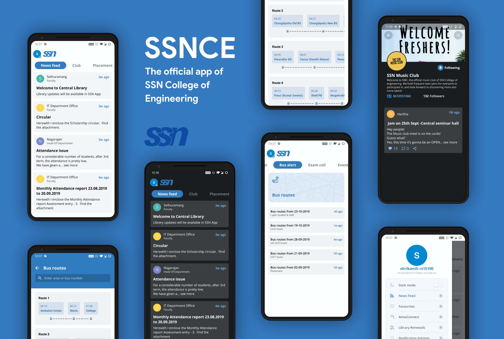

<h1 align="center">
  SSNCE
</h1>

<p align="center">
  Join our active, engaged community: <br>
  <strong>
    <a href="https://play.google.com/store/apps/details?id=in.edu.ssn.ssnapp">Playstore</a>
    |
    <a href="https://discord.gg/UZCM4Ae">Discord</a>
    |
    <a href="https://www.facebook.com/ssnceapp">Facebook</a>
    |
    <a href="https://www.instagram.com/ssnce_app">Instagram</a>
  </strong>
</p>

<p align="center">
  <a href="LICENSE"></a>
    <a href="https://github.com/ssn-developers/ssn-app/pulls"></a>
  <a href="https://github.com/ssn-developers/ssn-app/issues"></a>
    <a href="https://github.com/ddlogesh/zinger-framework/issues?q=is%3Aissue+is%3Aopen+label%3Aenhancement"></a>
</p>

SSNCE App allows you to get timely updates on feeds, events, workshops, clubs and placements from respective departments &amp; exam cell.

## Installation Setup

#### Fork Project

* [Fork](https://github.com/ssn-developers/ssn-app/fork) the Main Repository.

* Clone the forked repository `git clone forked_repo_url`

* Import the cloned project into Android Studio.

#### Setup Firebase

* Create a firebase project and [add](https://firebase.google.com/docs/android/setup) your android app to that project.

* Enable Google Sign-In in the Firebase console:
    * On the **Authentication** section, choose the **Sign-in method** tab and enable the Google sign-in method.
    
* Add your app's SHA-1 fingerprint:
    * [Generate](https://stackoverflow.com/a/36257777/10489902) SHA-1 key in android studio.
    * Go to **Settings** page of the Firebase console and add your SHA-1 key under **SHA certificate fingerprints**.
    
* Enable [Cloud Firestore](https://firebase.google.com/docs/firestore/quickstart#create) database and [Storage](https://firebase.google.com/docs/storage/android/start#create-default-bucket) in your firebase project.

* Populate mock data:
    * Install firebase-admin SDK
        ```
        pip3 install --upgrade setuptools
        pip3 install --upgrade gcloud
        pip3 install --upgrade firebase-admin
        ```
    * In the Firebase console, open **Settings > Service Accounts** and click **Generate New Private Key**
    * Open the python script [mockdata.py](https://github.com/ssn-developers/ssn-app/blob/master/mockdata.py).
    * Replace the value of the **JSON_PATH** variable with the downloaded JSON file path in the script.
    * Run the python script now `python3 mockdata.py`
    * Run the android project in an emulator or a physical device.

#### Note

* You may receive an error in the Logcat stating **Composite Index** not found. Please follow the [instruction](https://firebase.google.com/docs/firestore/query-data/indexing?authuser=0#create_a_missing_index_through_an_error_message) to create composite index manually.
* To enable notification in global chat, generate a new API Key from the [API console](https://console.developers.google.com/) and replace the generated key with the **SERVER_KEY** variable in [Constants](https://github.com/ssn-developers/ssn-app/blob/master/app/src/main/java/in/edu/ssn/ssnapp/utils/Constants.java) file.

## Enhancement


#### Project corner

Project corner is one of the highly recommended features by the ssnites for showcasing their skills and talents. It should help the students and alumni of SSN to share their project works, awards, etc to their peers.

#### Bus tracking

Tired of calling your bus mates in verifying whether the bus has arrived? Develop the bus tracking feature, to save the trouble of day scholars in tracking the location of the buses in realtime using Google Maps.

#### Attendance management

Worried about the attendance percentage at the end of every semester, then this feature is for you. Help your bunkmates to track and manage their attendance with ease.

## Contribution Guidelines

#### Git commit messages
To speed up the review process and to keep the logs tidy, we recommend the following simple rules on how to write good commit messages:

##### Summary line
* It should contain less than 50 characters. It is best to make it short.
* Introduce what has changed, using imperatives: fix, add, modify, etc.

##### Description
* Add extra explanation if you feel it will help others to understand the summary content.
* Avoid writing in one line. Use line breaks so the reader does not have to scroll horizontally.

For more information and tips on how to write good commit messages, see the GitHub [guide](https://github.com/erlang/otp/wiki/writing-good-commit-messages).

#### Requesting a Feature
You can raise a Github issues to request new features you would like to see in SSNCE app.

* Provide a clear and detailed explanation of the feature you want and why it's important to add. 
* Keep in mind that we want features that will be useful to the majority of our users and not just a small subset.

## Contact us

#### Discord

Join us in [Discord](https://discord.gg/UZCM4Ae) community.

#### Email

Send an email to ssnmobileapp@ssn.edu.in for more queries.

## Contributors

<a href="https://github.com/ezhilnero99"></a>&nbsp;
<a href="https://github.com/sujink1999"></a>&nbsp;
<a href="https://www.linkedin.com/in/amritha-sudharsan-436440164/"></a>&nbsp;
<a href="https://github.com/nandy20"></a>&nbsp;
<a href="https://github.com/pavithrakarumanchi"></a>&nbsp;
<a href="http://github.com/ddlogesh"></a>&nbsp;
<a href="https://github.com/harshavardhan98"></a>&nbsp;
<a href="https://github.com/shrikanth7698"></a>&nbsp;
<a href="https://github.com/TarunGanesh"></a>&nbsp;
<a href="https://www.linkedin.com/in/shibikannan-t-m-a79493155"></a>&nbsp;
<a href="https://github.com/karnikram"></a>&nbsp;
<a href="https://github.com/adithya321"></a>&nbsp;
<a href="https://github.com/varunranganathan"></a>&nbsp;
<a href="https://github.com/muthuct"></a>

## License
```
MIT License

Copyright (c) 2019 ssn-developers

Permission is hereby granted, free of charge, to any person obtaining a copy
of this software and associated documentation files (the "Software"), to deal
in the Software without restriction, including without limitation the rights
to use, copy, modify, merge, publish, distribute, sublicense, and/or sell
copies of the Software, and to permit persons to whom the Software is
furnished to do so, subject to the following conditions:

The above copyright notice and this permission notice shall be included in all
copies or substantial portions of the Software.

THE SOFTWARE IS PROVIDED "AS IS", WITHOUT WARRANTY OF ANY KIND, EXPRESS OR
IMPLIED, INCLUDING BUT NOT LIMITED TO THE WARRANTIES OF MERCHANTABILITY,
FITNESS FOR A PARTICULAR PURPOSE AND NONINFRINGEMENT. IN NO EVENT SHALL THE
AUTHORS OR COPYRIGHT HOLDERS BE LIABLE FOR ANY CLAIM, DAMAGES OR OTHER
LIABILITY, WHETHER IN AN ACTION OF CONTRACT, TORT OR OTHERWISE, ARISING FROM,
OUT OF OR IN CONNECTION WITH THE SOFTWARE OR THE USE OR OTHER DEALINGS IN THE
SOFTWARE.
```
